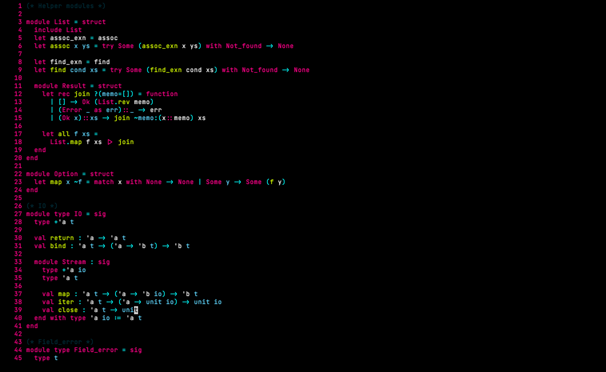
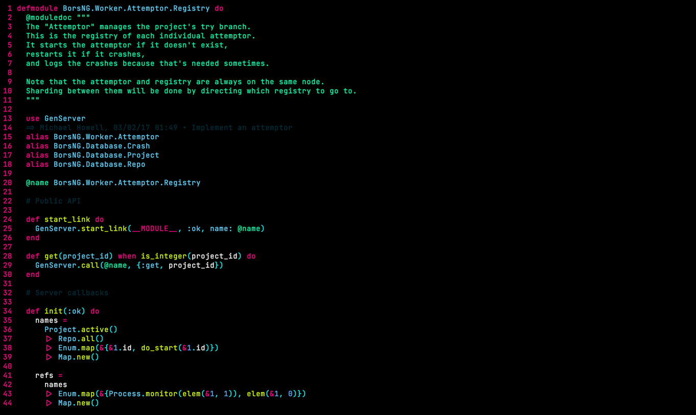
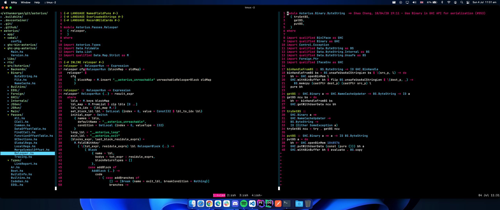
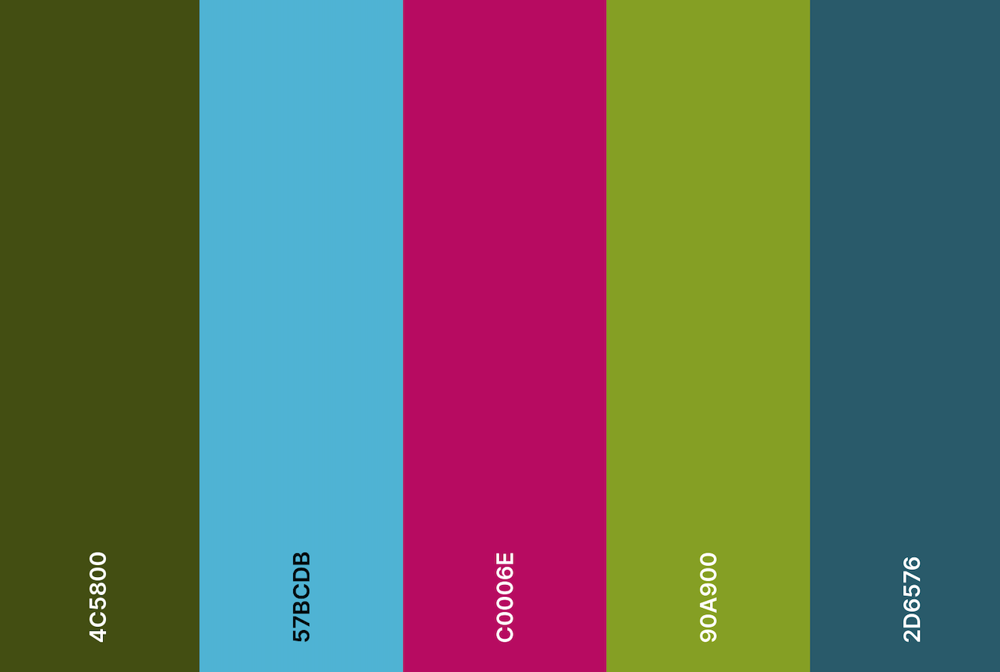

# {hotline}

# Contributing 
Feel free to make a PR, with a screenshot of what you've changed. Before and After preferably.

# Installation

### Option 1: Manual installation

1.  After downloading the vim script or package, move the
    `hotline.vim` file to the `.vim/colors` directory.

        $ cd hotline-vim/colors
        $ mv hotline.vim ~/.vim/colors/

### Option 2: Plug installation

```vimscript 
Plug 'epmor/hotline-vim'
```

### Modify .vimrc

```vimscript
syntax enable
set background=dark
colorscheme lampaces-demon
```
# Screenshots

## Better Highlighting (optional)
These screenshots use <a href="https://github.com/nvim-treesitter/nvim-treesitter">nvim treesitter for syntax hightlighting</a>

With these options

```vimscript
lua <<EOF
require'nvim-treesitter.configs'.setup {
    ensure_installed = "maintained",
    highlight = {
        enable = true,
    },
    rainbow = {
        enable = true,
    },
    indent = {
        enable = false,
    },
}
EOF
```

<div align="center">
  <h2>OCaml</h2>
  
  <h2>Elixir</h2>
  
  <h2>Haskell</h2>
  
</div>

# Pallete

In the same Order as the image below

4C5801, 57BCDA, C0006E, 90A900, 2D6576

<div align="center">
  <h2>Pallet</h2>
  
</div>

